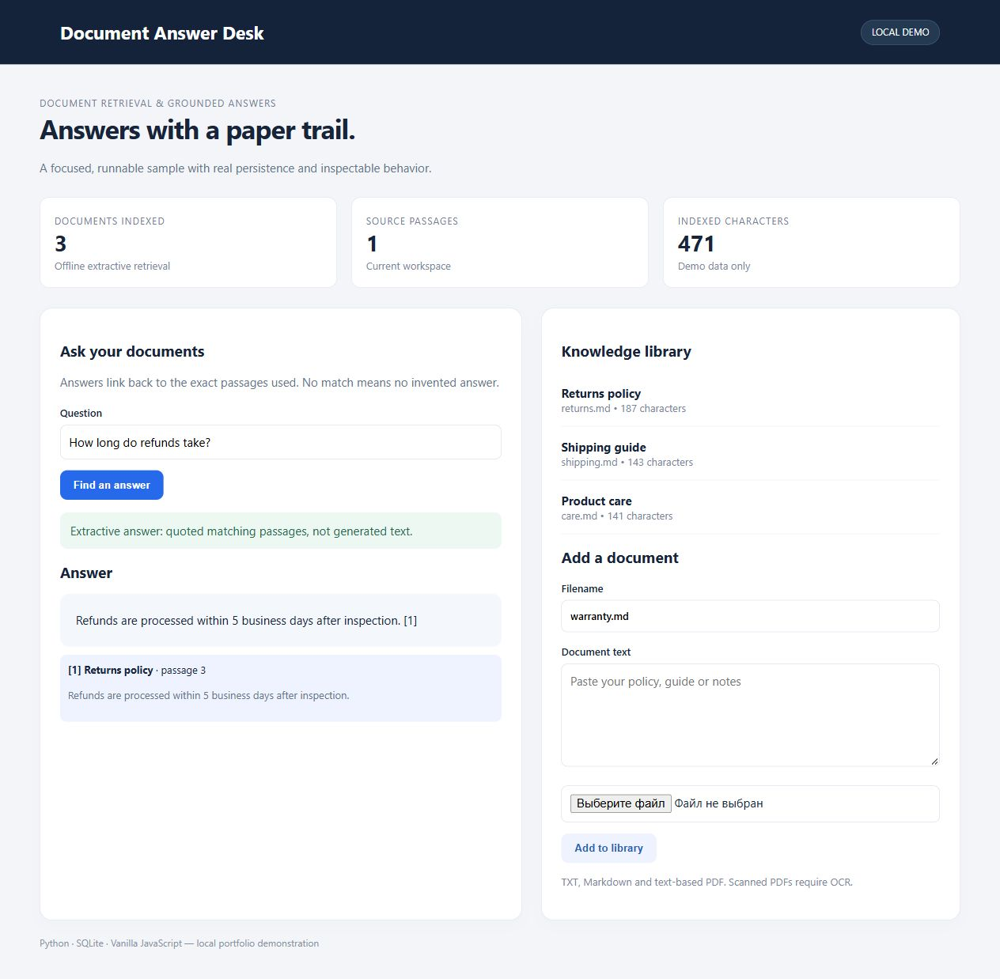

# Document Answer Desk

Answers with a paper trail. Document retrieval & grounded answers.



## Run locally

Python 3.12 or newer:

```sh
python -m venv .venv
# Windows: .venv\Scripts\activate
# Linux/macOS: source .venv/bin/activate
python -m pip install -r requirements.txt
python server.py
```

Open http://127.0.0.1:8765. Set `PORT` to use a different port.

## Tests

```sh
python -m unittest discover -s tests -v
```

## Structure

- `engine.py`: application rules and SQLite persistence.
- `server.py`: local HTTP adapter, bounded JSON requests and origin checks.
- `index.html`: responsive interface; untrusted text is escaped before rendering.
- `tests/`: behavior tests using temporary databases.

## Scope

This is a local, single-user portfolio demonstration. It binds to loopback and has no public account system. Do not expose it directly to the internet. Authentication, access isolation, quotas, monitoring and deployment hardening are separate work. Secrets and local databases are excluded from Git.

## Retrieval and generation

The default mode ranks sentences by normalized keyword overlap and returns matching excerpts with numbered sources. It is deterministic extractive retrieval, not semantic search or a generated AI answer. No matching excerpt returns an explicit unknown answer.

Optional local generation uses the [Ollama chat API](https://docs.ollama.com/api/chat). Install Ollama separately and download a model, then set `OLLAMA_MODEL` (for example to a model you already installed) before starting the server. `OLLAMA_URL` defaults to http://127.0.0.1:11434. The server sends the question and retrieved excerpts to that configured endpoint. Generated answers can still be wrong; inspect citations. This integration has mocked tests; a live model is not bundled.

TXT/MD and text-based PDFs are accepted; OCR and per-user access control are outside this local demo. Uploaded documents persist in SQLite. Reusing a filename replaces the document.
